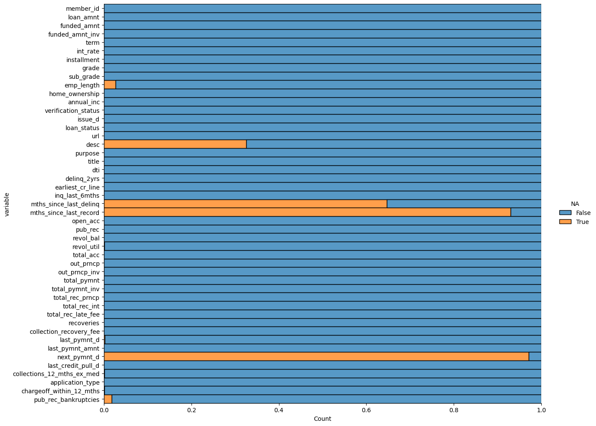

# Lending club case study
> This project aims to identify significant driving factors behind consumer loan defaults within the specified loan company, employing diverse range of Exploratory Data Analysis(EDA) methodologies. By identifying these key indicators, the company can improve its portfolio management and risk assessment practices. 

## Table of Contents
* [General Information](#general-information)
* [Project Structure](#project-structure)
* [Technologies Used](#technologies-used)
* [Conclusions](#conclusions)
* [Acknowledgements](#acknowledgements)

<!-- You can include any other section that is pertinent to your problem -->

## General Information
- This project delves into the domain of risk analytics within the consumer finance sector, particularly focusing on a company that specializes in lending various types of loans to urban customers.
- The crux of the business problem revolves around minimizing financial loss to the company and assesing it's risk.
- The [dataset](./loan.csv) & [dataset dictionary](./Data_Dictionary.xlsx) used contains the complete loan data for all consumer loans issued through the time period 2007 t0 2011.

<!-- You don't have to answer all the questions - just the ones relevant to your project. -->

## Project Structure
- [Dataset](./loan.csv) - Dataset of the consumer loan company 
- [Data Dictionary](./Data_Dictionary.xlsx) - Metadata of the dataset, mainly column description
- [Jupyter Notebook](LendingClubCaseStudy.ipynb) - File used for performing EDA

## Technologies Used
- Python - 3.8
- Pandas - 1.5.3
- Matplotlib - 3.7.0
- Plotly - 5.9.0
- Seaborn - 0.11.1
- Numpy - 1.23.5
- Jupyter Notebook - 6.5.2

<!-- As the libraries versions keep on changing, it is recommended to mention the version of library used in this project -->

## Conclusions
- Conclusion 1 from the analysis
- Conclusion 2 from the analysis
- Conclusion 3 from the analysis
- Conclusion 4 from the analysis

<!-- You don't have to answer all the questions - just the ones relevant to your project. -->
## Acknowledgements
Give credit here.
- This project was inspired by the real-world challenges faced by lending institutions in mitigating credit loss while striving to expand their customer base.
- References if any...
- This project was based on [this tutorial](https://www.example.com).

## Contact
Created by [@newmohit][@2610geetha] - feel free to contact us!

<!-- Optional -->
<!-- ## License -->
<!-- This project is open source and available under the [... License](). -->

<!-- You don't have to include all sections - just the one's relevant to your project -->